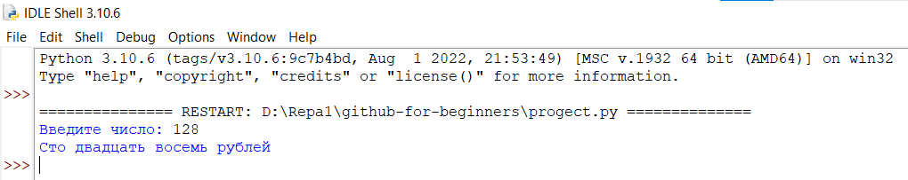
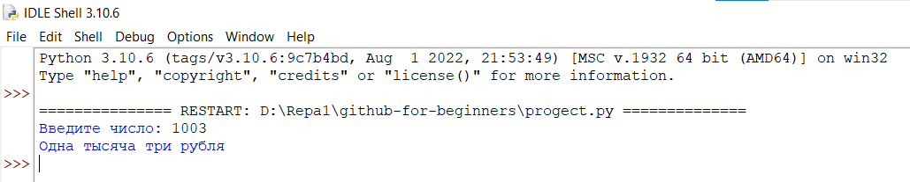
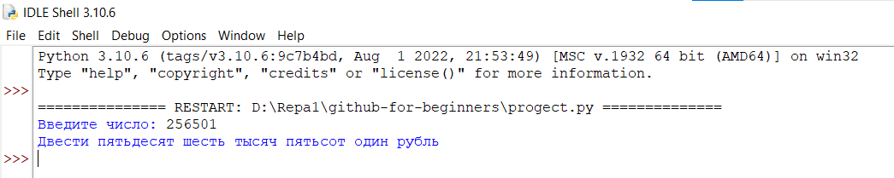

# github-for-beginners
*Автор: Дубовик Анастасия Александровна*
####Краткое описание программы:
>Программа написана на языке программировния Python и позволяет вывести на экран словами (с заглавной буквы) введенное пользователем число (сумму выдачи в банкомате от 1 до 999999) с названием валюты (рубли).
##### Как пользоваться проектом:
+ Откройте файл *progect.py* с помощью среды программирования IDLE (Edit with IDLE)
+ Чтобы запустить код, выберите "Run" → "Run Module" (или F5)
+ Введите число от 1 до 999999, нажмите *Enter*
---

---

