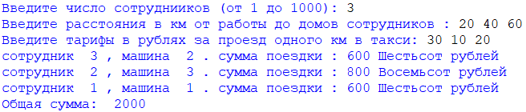
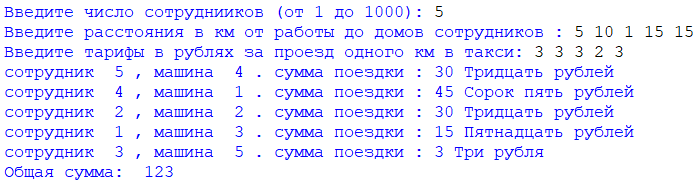

##ТАКСИ
###### *Автор: Дубовик Анастасия Александровна*
Краткое описание программы:
> Код написан на языке программирования Python. Программа работает следующим образом: пользователь вводит число сотрудников, расстояние в км от работы до дома для каждого сотрудника и тарифы в рублях за проезд 1 км в такси. Программа определяет какой номер такси подойдет для каждого сотрудника, чтобы суммарные затраты на такси были минимальными.

#### **Как пользоваться проектом:**
+ Откройте файл *Такси.py* с помощью среды программирования IDLE (Edit with IDLE)
+ Чтобы запустить код, выберите "Run" → "Run Module" (или F5)
+ Введите число сотрудников, расстояния и тарифы
---
*Тест 1*

*Тест 2*

---
