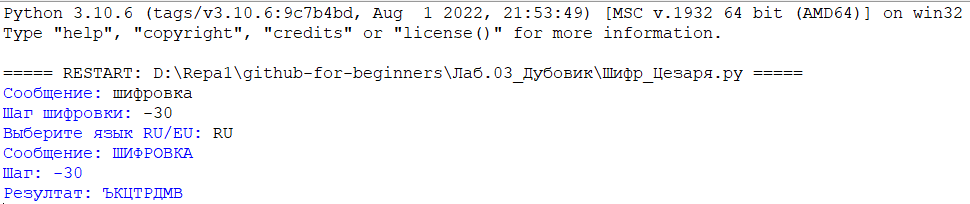

##ШИФР ЦЕЗАРЯ
######*Автор: Дубовик Анастасия Александровна*
Краткое описание программы:
>Код написан на языке программирования Python. Программа работает следующим образом: пользователь вводит шаг шифровки и строку, состоящую из букв русского или английского алфавита, каждый символ заменяется символом, находящимся на некотором числе позиций левее или правее него в алфавите (в зависимости от шага).

####**Как пользоваться проектом:**
+ Откройте файл *Шифр_Цезаря.py* с помощью среды программирования IDLE (Edit with IDLE)
+ Чтобы запустить код, выберите "Run" → "Run Module" (или F5)
+ Введите шаг шифровки, сообщение и выберите язык
---
*Шифрование строки "ПРИВЕТ" на 3 шага*

*Шифрование строки "HALLO" на 7 шагов*

*Шифрование строки "АРЫШЦЙЗХРМ" на -8 шагов*

---
