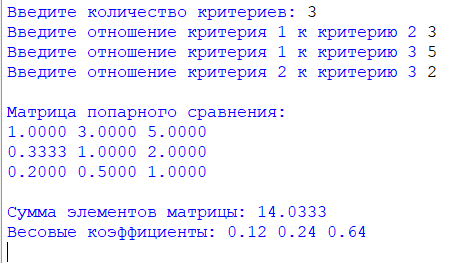
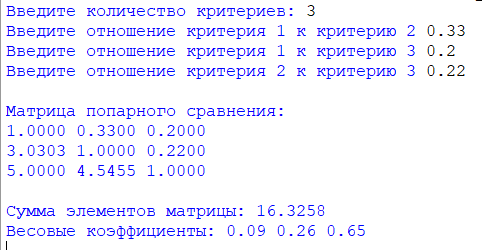

### Метод анализа иерархий Томаса Саати для одного уровня
###### *Автор: Дубовик Анастасия Александровна*
Краткое описание программы:
> Программа запрашивает у пользователя коэффициенты важности попарного сравнения элементов, а затем вычисляет коэффициенты для метода анализа иерархий на основе заданных коэффициентов 
#### **Как пользоваться проектом:**
+ Откройте файл *Метод_анализа_иерархий.py* с помощью среды программирования IDLE (Edit with IDLE)
+ Чтобы запустить код, выберите "Run" → "Run Module" (или F5)
+ Введите шаг шифровки, сообщение и выберите язык
---

*Тест 1*

*Тест 2*

---