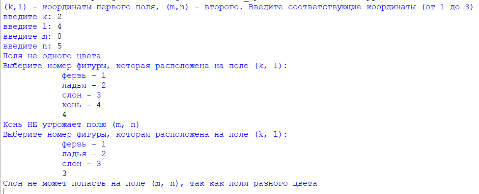
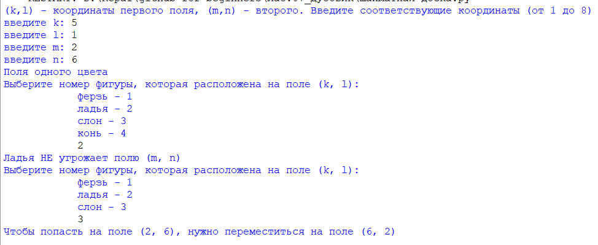
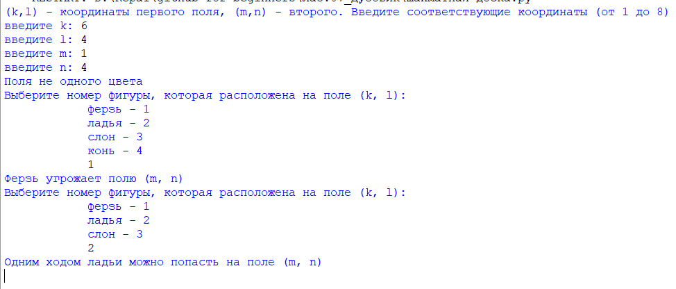

### Шахматы
###### *Автор: Дубовик Анастасия Александровна*
Краткое описание программы:
> Программа написана на языке программирования Python, отвечает на следующие вопросы:
> + одного ли цвета два поля шахматной доски, (координаты полей вводит пользователь);
> + угрожает ли фигура, выбранная пользователем на первом поле, второму полю;
> + может ли фигура, выбранная пользователем, попасть с первого поля на второе за один ход; если нет, то как это сделать за два хода.

#### **Как пользоваться проектом:**
+ Откройте файл *Шахматы.py* с помощью среды программирования IDLE (Edit with IDLE)
+ Чтобы запустить код, выберите "Run" → "Run Module" (или F5)
+ Вводите значения, запрошенные программой
---

*Тест 1*

*Тест 2*

*Тест 3*

---