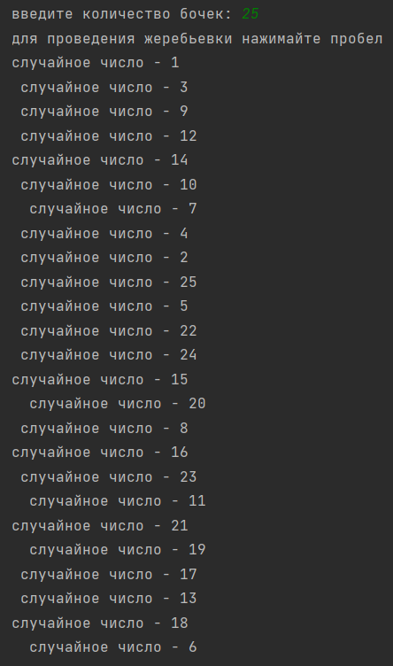

### Жеребьевка
###### *Автор: Дубовик Анастасия Александровна*
Краткое описание программы:
> Программа написана на языке программирования Python, генерирует случайные числа (без повторений) для проведения жеребьевки.

#### **Как пользоваться проектом:**
+ Откройте файл *Жеребьевка.py* с помощью среды программирования PyCharm 
+ Чтобы запустить код, выберите "Run" (или нажмите Shift + F10)
+ Введите количество бочек, нажимайте пробел для вывода номера очередного бочонка
---

*Тест 1*

*Тест 2*

*Тест 3*

---