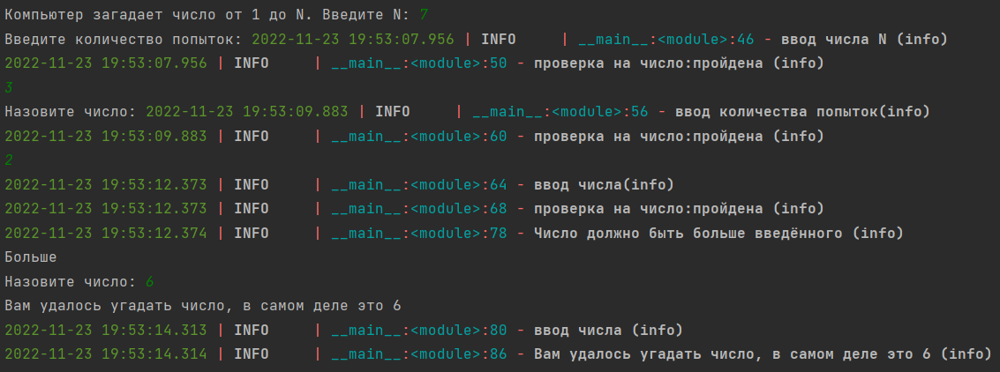
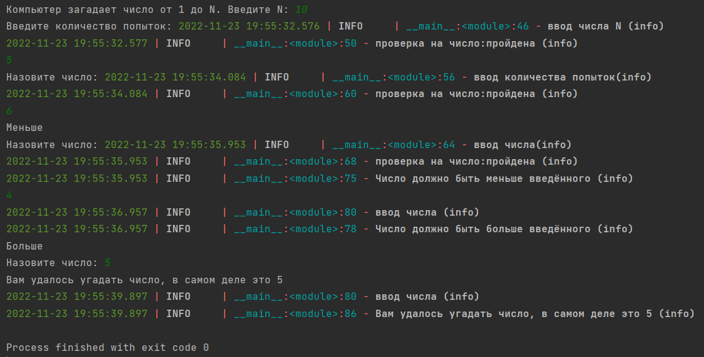

### Угадай число
###### *Автор: Дубовик Анастасия Александровна*
Краткое описание программы:
> Программа написана на языке программирования Python. Компьютер загадывает число от 1 до N. У пользователя k попыток отгадать. После каждой неудачной попытки компьютер сообщает меньше или больше загаданное число. В конце игры текст с результатом. 

#### **Как пользоваться проектом:**
+ Откройте файл *Угадай число.py* с помощью среды программирования PyCharm 
+ Чтобы запустить код, выберите "Run" (или нажмите Shift + F10)
+ Введите число N, количество попыток и угадывайте число
---

*Тест 1*

*Тест 2*

---