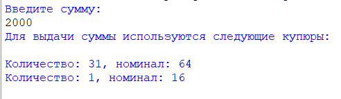
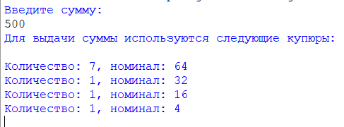
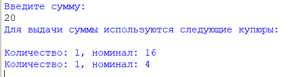

### Купюры
###### *Автор: Дубовик Анастасия Александровна*
Краткое описание программы:
> В некоторой стране используются денежные купюры достоинством в 1, 2, 4, 8, 16, 32 и 64. Дано натуральное число N. Программа определяет, как наименьшим количеством таких денежных купюр можно выплатить сумму N. Предполагается, что имеется достаточно большое количество купюр всех достоинств.  

#### **Как пользоваться проектом:**
+ Откройте файл *Купюры.py* с помощью среды программирования PyCharm 
+ Чтобы запустить код, выберите "Run" (или нажмите Shift + F10)
+ Введите сумму N
---

*Тест 1*

*Тест 2*

*Тест 3*

---